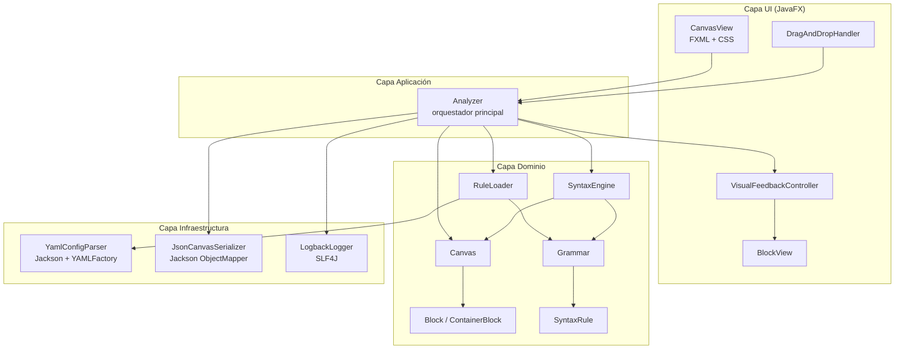
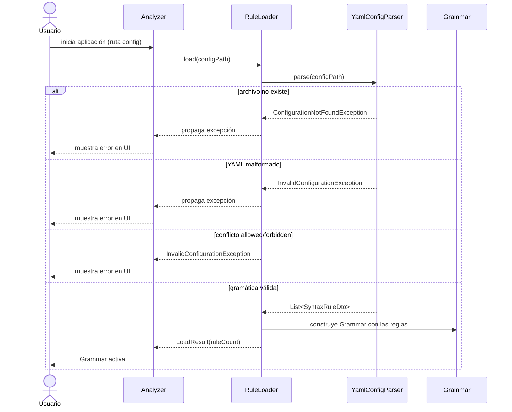
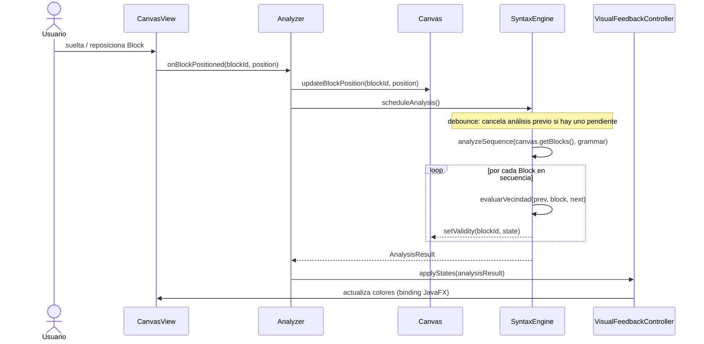
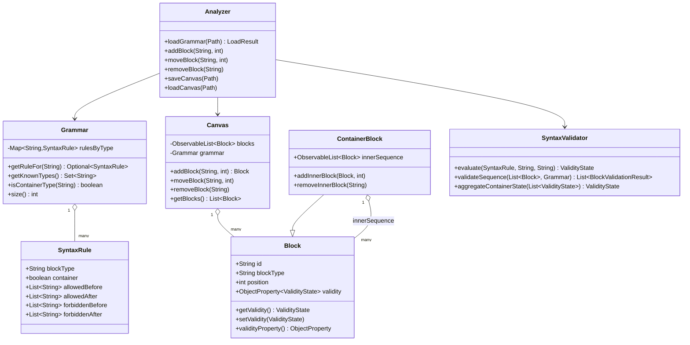
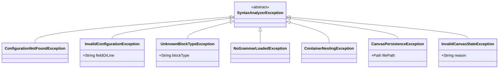
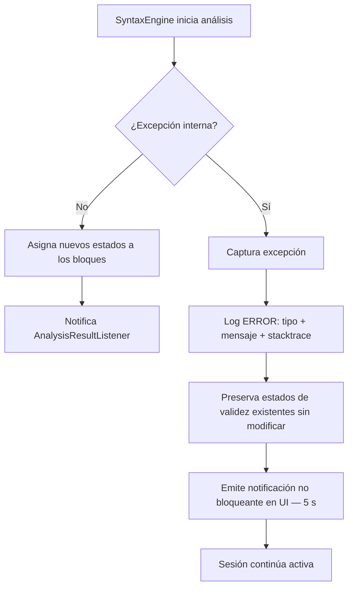

# Diseño Técnico: Analizador Sintáctico

## Overview

El **Analizador Sintáctico** es una aplicación de escritorio Java 17 + JavaFX 21 que permite a los usuarios construir secuencias de bloques lógicos mediante arrastrar y soltar, obteniendo retroalimentación visual en tiempo real sobre la validez sintáctica de cada posición. Las reglas de sintaxis se definen en un archivo de configuración YAML externo, lo que permite modificar la gramática sin recompilar la aplicación.

### Objetivos

- Cargar y validar una gramática definida en YAML con soporte de listas `allowedBefore/After` y `forbiddenBefore/After`, donde `EMPTY` representa los extremos de la secuencia.
- Analizar en tiempo real (≤ 200 ms) la validez sintáctica de cada bloque en la secuencia.
- Proporcionar retroalimentación visual inmediata (colores verde/rojo/gris) por estado de validez.
- Soportar `ContainerBlocks` con análisis independiente de su secuencia interna (hasta 1 nivel de profundidad).
- Persistir y restaurar el estado del Canvas en formato JSON.
- Gestionar errores de forma robusta sin interrumpir la sesión del usuario.

### Stack Tecnológico

| Capa | Tecnología |
|------|-----------|
| Lenguaje | Java 17 |
| UI | JavaFX 21 (FXML + CSS) |
| Parseo YAML (gramática) | Jackson 2.x + `jackson-dataformat-yaml` |
| Serialización JSON (canvas) | Jackson 2.x `ObjectMapper` |
| Logging | SLF4J + Logback |
| Tests unitarios | JUnit 5 |
| Tests de propiedades | jqwik 1.x |
| Build | Maven 3.9+ |

---

## Architecture

### Diagrama de capas



### Principios de diseño

- **Separación estricta de capas**: la lógica de dominio (validación sintáctica) no conoce JavaFX; la UI no invoca directamente el `SyntaxEngine`.
- **Inmutabilidad de reglas**: una vez cargada, la `Grammar` es inmutable hasta que se recargue explícitamente.
- **Análisis debounceado**: el `SyntaxEngine` cancela análisis en curso ante nuevos eventos de posicionamiento (patrón debounce con `ScheduledExecutorService`).
- **Propiedades observables**: los estados de validez de los bloques son `ObjectProperty<ValidityState>` de JavaFX, permitiendo binding directo con la UI.

### Flujo principal: carga de gramática



### Flujo principal: posicionamiento de bloque y análisis



### Flujo: ContainerBlock — análisis interno

```mermaid
sequenceDiagram
    participant SE as SyntaxEngine
    participant CB as ContainerBlock
    participant G as Grammar

    SE->>CB: analyzeContainer(containerBlock, grammar)
    SE->>SE: analyzeSequence(containerBlock.getInnerSequence(), grammar)
    loop por cada Block interno
        SE->>SE: evaluarVecindad(prevInner, innerBlock, nextInner)
    end
    SE->>SE: aggregateContainerState(innerBlockStates)
    Note over SE: INVALID si alguno es INVALID;<br/>VALID si todos son VALID;<br/>UNCHECKED si todos son UNCHECKED
    SE-->>CB: setValidity(aggregatedState)
```

---

## Components and Interfaces

### `Analyzer` (orquestador)

Punto de entrada de la aplicación. Coordina la carga de gramática, las operaciones del Canvas y la integración con el `SyntaxEngine`.

```java
public class Analyzer {
    public LoadResult loadGrammar(Path configPath)
        throws ConfigurationNotFoundException, InvalidConfigurationException;

    public void addBlock(String blockType, int position)
        throws UnknownBlockTypeException, NoGrammarLoadedException;

    public void moveBlock(String blockId, int newPosition);

    public void removeBlock(String blockId);

    public void saveCanvas(Path outputPath) throws CanvasPersistenceException;

    public void loadCanvas(Path inputPath)
        throws CanvasPersistenceException, InvalidCanvasStateException;
}
```

### `RuleLoader`

Responsable de leer e interpretar el `Configuration_File` YAML.

```java
public interface RuleLoader {
    /**
     * @throws ConfigurationNotFoundException si la ruta no existe
     * @throws InvalidConfigurationException  si el YAML es inválido o hay conflictos allowed/forbidden
     */
    LoadResult load(Path configPath)
        throws ConfigurationNotFoundException, InvalidConfigurationException;
}

public class YamlRuleLoader implements RuleLoader {
    private final YamlConfigParser parser;
    // validación de conflictos, construcción de Grammar
}

public record LoadResult(Grammar grammar, int ruleCount) {}
```

### `Grammar`

Colección inmutable de `SyntaxRule`. Actúa como repositorio de reglas durante una sesión.

```java
public class Grammar {
    private final Map<String, SyntaxRule> rulesByType; // blockType → SyntaxRule

    public Optional<SyntaxRule> getRuleFor(String blockType);
    public Set<String> getKnownTypes();
    public boolean isContainerType(String blockType);
    public int size();
}
```

### `SyntaxRule`

Modelo de dominio de una regla. Inmutable.

```java
public record SyntaxRule(
    String blockType,
    boolean container,
    List<String> allowedBefore,   // "EMPTY" = puede ser el primero
    List<String> allowedAfter,    // "EMPTY" = puede ser el último
    List<String> forbiddenBefore, // precedencia sobre allowedBefore
    List<String> forbiddenAfter   // precedencia sobre allowedAfter
) {}
```

### `Block` y `ContainerBlock`

```java
public class Block {
    private final String id;          // UUID asignado por Canvas
    private final String blockType;
    private int position;             // índice en la secuencia
    private ObjectProperty<ValidityState> validity; // UNCHECKED, VALID, INVALID

    public String getId();
    public String getBlockType();
    public int getPosition();
    public ValidityState getValidity();
    public void setValidity(ValidityState state);
    public ObjectProperty<ValidityState> validityProperty();
}

public class ContainerBlock extends Block {
    private final ObservableList<Block> innerSequence;

    public ObservableList<Block> getInnerSequence();
    public void addInnerBlock(Block block, int position)
        throws ContainerNestingException; // rechaza otro ContainerBlock
    public void removeInnerBlock(String blockId);
}

public enum ValidityState { UNCHECKED, VALID, INVALID }
```

### `Canvas`

Gestiona la secuencia principal de bloques. Emite eventos ante cambios en la secuencia.

```java
public class Canvas {
    private final ObservableList<Block> blocks;
    private Grammar grammar; // puede ser null si aún no se cargó

    public Block addBlock(String blockType, int position)
        throws UnknownBlockTypeException, NoGrammarLoadedException;

    public void moveBlock(String blockId, int newPosition);
    public void removeBlock(String blockId);
    public List<Block> getBlocks();
    public void setGrammar(Grammar grammar);

    /** Listener para que el Analyzer suscriba el re-análisis */
    public void addSequenceChangeListener(SequenceChangeListener listener);
}
```

### `SyntaxEngine`

Evalúa la secuencia completa de bloques y asigna estados de validez. Corre análisis de forma asíncrona con debounce de 200 ms.

```java
public interface SyntaxEngine {
    /**
     * Programa un análisis con debounce de 200ms.
     * Cancela cualquier análisis pendiente anterior.
     */
    void scheduleAnalysis(List<Block> sequence, Grammar grammar);

    /** Cancela el análisis pendiente si existe. */
    void cancelPendingAnalysis();

    /** Añade listener para recibir resultados. */
    void addResultListener(AnalysisResultListener listener);
}

public class DebouncedsyntaxEngine implements SyntaxEngine {
    private static final long DEBOUNCE_MS = 200;
    private final ScheduledExecutorService scheduler;
    // ...
}

/**
 * Lógica pura de validación. Sin estado, sin concurrencia.
 * Facilita el testing.
 */
public class SyntaxValidator {
    public ValidityState evaluate(SyntaxRule rule, String prevType, String nextType);
    public List<BlockValidationResult> validateSequence(List<Block> blocks, Grammar grammar);
    public ValidityState aggregateContainerState(List<ValidityState> innerStates);
}

public record BlockValidationResult(String blockId, ValidityState state) {}
```

### `VisualFeedbackController`

Aplica colores CSS a los `BlockView` en función del estado de validez.

```java
public class VisualFeedbackController {
    // Bindings JavaFX: cada BlockView escucha el validityProperty() de su Block
    public void bind(BlockView view, Block block);
    public void unbind(BlockView view);
}
```

Los estilos CSS se definen en `syntax-analyzer.css`:

```css
.block-valid   { -fx-background-color: #4CAF50; } /* verde */
.block-invalid { -fx-background-color: #F44336; } /* rojo  */
.block-unchecked { -fx-background-color: #9E9E9E; } /* gris  */
```

### `YamlConfigParser`

Envuelve Jackson + `YAMLFactory`. Mapea el YAML a DTOs.

```java
public class YamlConfigParser {
    private final ObjectMapper yamlMapper; // ObjectMapper con YAMLFactory

    public GrammarConfigDto parse(Path path)
        throws ConfigurationNotFoundException, InvalidConfigurationException;
}
```

### `JsonCanvasSerializer`

Envuelve `ObjectMapper` estándar para persistencia del Canvas.

```java
public class JsonCanvasSerializer {
    private final ObjectMapper jsonMapper;

    public void serialize(List<Block> blocks, Path outputPath) throws CanvasPersistenceException;
    public List<Block> deserialize(Path inputPath, Grammar grammar)
        throws CanvasPersistenceException, InvalidCanvasStateException;
}
```

---

## Data Models

### DTO YAML — Gramática (`GrammarConfigDto`)

Estos DTOs son usados exclusivamente para la deserialización YAML. No forman parte del dominio.

```java
/** Raíz del YAML */
public class GrammarConfigDto {
    public List<SyntaxRuleDto> blocks;
}

/** Entrada por tipo de bloque */
public class SyntaxRuleDto {
    public String type;
    public boolean container;
    public List<String> allowedBefore;
    public List<String> allowedAfter;
    public List<String> forbiddenBefore;
    public List<String> forbiddenAfter;
}
```

Ejemplo YAML completo:

```yaml
blocks:
  - type: "A"
    container: false
    allowedBefore: ["EMPTY", "B"]
    allowedAfter:  ["B", "EMPTY"]
    forbiddenBefore: []
    forbiddenAfter:  ["C"]
  - type: "B"
    container: true
    allowedBefore: ["A"]
    allowedAfter:  ["EMPTY"]
    forbiddenBefore: []
    forbiddenAfter:  []
```

### DTO JSON — Estado del Canvas (`CanvasStateDto`)

Usado exclusivamente para persistencia/restauración del Canvas.

```java
public class CanvasStateDto {
    public String version;           // "1.0"
    public List<BlockStateDto> blocks;
}

public class BlockStateDto {
    public String id;
    public String blockType;
    public int position;
    @JsonProperty("innerSequence")
    public List<BlockStateDto> innerSequence; // null para bloques normales
}
```

Ejemplo JSON:

```json
{
  "version": "1.0",
  "blocks": [
    { "id": "uuid-1", "blockType": "A", "position": 0, "innerSequence": null },
    {
      "id": "uuid-2", "blockType": "B", "position": 1,
      "innerSequence": [
        { "id": "uuid-3", "blockType": "A", "position": 0, "innerSequence": null }
      ]
    }
  ]
}
```

### Diagrama de clases de dominio



---

## Correctness Properties

*Una propiedad es una característica o comportamiento que debe mantenerse verdadero en todas las ejecuciones válidas del sistema — esencialmente, un enunciado formal sobre lo que el sistema debe hacer. Las propiedades sirven como puente entre las especificaciones legibles por humanos y las garantías de corrección verificables automáticamente.*

### Property 1: Round-trip de gramática YAML

*Para cualquier* `Grammar` válida con un conjunto arbitrario de `SyntaxRule`, serializar esa `Grammar` a YAML y luego parsearla de vuelta debe producir una `Grammar` con exactamente las mismas reglas: mismo conjunto de `blockType`, mismas listas `allowedBefore`, `allowedAfter`, `forbiddenBefore`, `forbiddenAfter` y mismo valor de `container`.

**Validates: Requirements 1.2, 1.5, 1.6**

---

### Property 2: Conflicto allowed/forbidden lanza excepción

*Para cualquier* definición de bloque donde `allowedBefore ∩ forbiddenBefore ≠ ∅` o `allowedAfter ∩ forbiddenAfter ≠ ∅`, el `RuleLoader` debe lanzar `InvalidConfigurationException` al intentar cargar esa configuración YAML.

**Validates: Requirements 1.7**

---

### Property 3: YAML inválido o malformado siempre lanza excepción

*Para cualquier* cadena de texto que no sea YAML válido conforme al esquema esperado (campo requerido ausente, tipo de dato incorrecto, estructura incorrecta), el `YamlConfigParser` debe lanzar `InvalidConfigurationException` sin modificar el estado del `Analyzer`.

**Validates: Requirements 1.4**

---

### Property 4: Invariante de bloque recién creado

*Para cualquier* secuencia de adiciones de bloques a un `Canvas` con gramática cargada y tipos válidos, cada bloque recién añadido debe tener: identificador no nulo y único respecto al resto de bloques del `Canvas`, posición coherente con la posición de inserción solicitada, y estado de validez `UNCHECKED`.

**Validates: Requirements 2.1, 2.2**

---

### Property 5: Rechazo de tipos desconocidos

*Para cualquier* `Grammar` con un conjunto definido de tipos y *para cualquier* `String` que no pertenezca a ese conjunto, intentar añadir un bloque de ese tipo al `Canvas` debe ser rechazado y el `Canvas` debe permanecer sin cambios.

**Validates: Requirements 2.3, 2.4**

---

### Property 6: Corrección del algoritmo de validación sintáctica

*Para cualquier* `Grammar` válida y *para cualquier* secuencia no vacía de bloques cuyos tipos estén definidos en esa `Grammar`, el `SyntaxValidator.validateSequence` debe asignar a cada bloque exactamente uno de los estados `VALID` o `INVALID` siguiendo el algoritmo con la siguiente precedencia:
1. `INVALID` si `prev ∈ forbiddenBefore` OR `next ∈ forbiddenAfter`
2. `INVALID` si `prev ∉ allowedBefore` OR `next ∉ allowedAfter`
3. `VALID` en caso contrario

donde `prev` y `next` son `"EMPTY"` en los extremos de la secuencia.

**Validates: Requirements 3.2, 3.7**

---

### Property 7: Agregación de estado de ContainerBlock

*Para cualquier* lista de estados de bloques internos (`List<ValidityState>`), `SyntaxValidator.aggregateContainerState` debe devolver:
- `INVALID` si al menos un elemento es `INVALID`
- `VALID` si todos los elementos son `VALID` (lista no vacía)
- `UNCHECKED` si todos los elementos son `UNCHECKED`
- `VALID` si la lista está vacía

**Validates: Requirements 8.3, 8.4**

---

### Property 8: Rechazo de anidamiento de ContainerBlocks

*Para cualquier* `ContainerBlock` y *para cualquier* bloque cuyo tipo tenga `container: true` en la `Grammar` activa, intentar añadir ese bloque a la `innerSequence` del `ContainerBlock` debe ser rechazado y la `innerSequence` debe permanecer sin cambios.

**Validates: Requirements 8.6**

---

### Property 9: Round-trip de persistencia del Canvas

*Para cualquier* estado del `Canvas` (secuencia arbitraria de `Block` y `ContainerBlock` con sus `innerSequence`), serializar ese estado a JSON y luego deserializarlo debe producir una secuencia de bloques con exactamente los mismos `blockType`, `position` e `id`, y los mismos `innerSequence` para los `ContainerBlock`, preservando el orden.

**Validates: Requirements 6.1, 6.2, 6.4**

---

### Property 10: Estado del Canvas invariante ante JSON inválido

*Para cualquier* estado inicial del `Canvas` y *para cualquier* archivo JSON que sea malformado, le falten campos requeridos (`id`, `blockType`, `position`) o incluya tipos de bloque no definidos en la `Grammar` activa, intentar cargar ese archivo debe dejar el `Canvas` con exactamente el mismo estado que tenía antes del intento de carga.

**Validates: Requirements 6.3**

---

### Property 11: Estados previos preservados ante error interno del SyntaxEngine

*Para cualquier* `Canvas` con bloques que tienen estados de validez ya asignados, cuando el `SyntaxEngine` lanza una excepción interna durante el análisis, cada bloque debe conservar el estado de validez que tenía antes de que comenzara el análisis fallido.

**Validates: Requirements 7.3**

---

### Property 12: Mapeo biyectivo estado→color

*Para cualquier* bloque en cualquier estado de validez (`VALID`, `INVALID`, `UNCHECKED`), el `VisualFeedbackController` debe asignarle exactamente una clase CSS de estado activa a la vez, y esa clase debe corresponder biunívocamente al estado: `VALID→block-valid`, `INVALID→block-invalid`, `UNCHECKED→block-unchecked`.

**Validates: Requirements 4.1, 4.2, 4.3, 4.5**

---

### Property 13: Inserción de bloque incrementa la secuencia en 1

*Para cualquier* secuencia de bloques en el `Canvas` y *para cualquier* posición de inserción válida, añadir un nuevo bloque debe resultar en que la longitud de la secuencia aumente exactamente en 1 y el nuevo bloque se encuentre en la posición indicada.

**Validates: Requirements 5.1**

---

### Property 14: Eliminación de bloque decrementa la secuencia en 1

*Para cualquier* secuencia no vacía de bloques en el `Canvas` y *para cualquier* bloque existente en esa secuencia, eliminarlo debe resultar en que la longitud de la secuencia disminuya exactamente en 1 y el bloque eliminado ya no esté presente en la secuencia.

**Validates: Requirements 5.3**

---

### Property 15: Cancelación de arrastre no modifica la secuencia

*Para cualquier* estado del `Canvas` y *para cualquier* operación de arrastre iniciada pero cancelada mediante Escape, la secuencia de bloques después de la cancelación debe ser idéntica (mismos bloques, mismo orden, mismas posiciones) a la secuencia anterior al inicio del arrastre.

**Validates: Requirements 5.7**

---

## Error Handling

### Estrategia por nivel

| Nivel | Tipo de error | Estrategia | Visibilidad |
|-------|--------------|-----------|-------------|
| Configuración | `ConfigurationNotFoundException` | Excepción propagada, aplicación no inicia en modo análisis | Error en UI de inicio |
| Configuración | `InvalidConfigurationException` | Excepción propagada, aplicación no inicia en modo análisis | Error en UI de inicio con detalle de campo/línea |
| Canvas | `UnknownBlockTypeException` | Rechaza operación, notifica al usuario | Mensaje no bloqueante en UI |
| Canvas | `NoGrammarLoadedException` | Rechaza operación, notifica al usuario | Mensaje no bloqueante en UI |
| Canvas | `ContainerNestingException` | Rechaza operación, notifica al usuario | Mensaje no bloqueante en UI |
| Análisis | Error interno `SyntaxEngine` | Preserva último estado válido, registra en log | Notificación auto-desaparecida (5 s) |
| Persistencia | `CanvasPersistenceException` | Operación cancelada, Canvas sin cambios | Mensaje de error en UI |
| Persistencia | `InvalidCanvasStateException` | Operación cancelada, Canvas sin cambios | Mensaje de error con causa en UI |
| Global | Excepción no controlada | Log `ERROR`, sesión continúa activa | Notificación de error genérico |

### Jerarquía de excepciones



### Flujo de manejo de error en análisis



### Manejador de excepciones global

```java
// En la inicialización de JavaFX Application
Thread.setDefaultUncaughtExceptionHandler((thread, ex) -> {
    log.error("Excepción no controlada en thread {}: {}", thread.getName(), ex.getMessage(), ex);
    Platform.runLater(() -> notificationService.showError("Error inesperado. La sesión continúa activa."));
});
```

---

## Testing Strategy

### Estrategia dual

El proyecto combina:
- **Tests de propiedades** (jqwik): validan comportamientos universales a través de muchas entradas generadas.
- **Tests de ejemplo** (JUnit 5): validan casos concretos, condiciones de error y flujos de integración.

### Estructura Maven de módulos de prueba

```
src/
├── main/java/com/sintacticanalyzer/
│   ├── analyzer/         → Analyzer.java
│   ├── domain/           → Block, ContainerBlock, Canvas, Grammar, SyntaxRule, ValidityState
│   ├── engine/           → SyntaxValidator, DebouncedSyntaxEngine
│   ├── config/           → YamlRuleLoader, YamlConfigParser
│   ├── persistence/      → JsonCanvasSerializer
│   ├── ui/               → CanvasView, BlockView, VisualFeedbackController, DragAndDropHandler
│   └── exception/        → jerarquía de excepciones
└── test/java/com/sintacticanalyzer/
    ├── properties/       → tests jqwik (Properties 1-15)
    ├── unit/             → tests JUnit 5 por componente
    └── integration/      → tests JUnit 5 de flujos completos
```

### Generadores jqwik

Para que los tests de propiedades sean efectivos, se definen los siguientes generadores arbitrarios:

```java
// Generador de SyntaxRule válida con listas sin conflictos
@Provide
Arbitrary<SyntaxRule> validSyntaxRules() {
    Arbitrary<String> blockType = Arbitraries.strings().alpha().ofLength(1);
    Arbitrary<List<String>> allowed = Arbitraries.of("EMPTY","A","B","C","D")
        .list().ofMinSize(1).ofMaxSize(4);
    // forbidden debe ser disjunto de allowed para ser válido
    return Combinators.combine(blockType, allowed, allowed, Arbitraries.of(false, true))
        .as((type, ab, aa, container) ->
            new SyntaxRule(type, container, ab, aa, List.of(), List.of()));
}

// Generador de Grammar válida con 1..5 reglas sin tipos duplicados
@Provide
Arbitrary<Grammar> validGrammars() { ... }

// Generador de secuencia de Block usando tipos de una Grammar dada
@Provide("blockSequence")
Arbitrary<List<Block>> blockSequences(Grammar grammar) { ... }

// Generador de CanvasState con ContainerBlocks opcionales
@Provide
Arbitrary<List<Block>> canvasStates(Grammar grammar) { ... }
```

### Tabla de cobertura por propiedad

| Propiedad | Tipo test | Clase de prueba | Iteraciones |
|-----------|----------|-----------------|-------------|
| P1: Round-trip YAML | jqwik | `GrammarYamlRoundTripTest` | 200 |
| P2: Conflicto allowed/forbidden | jqwik | `RuleLoaderConflictTest` | 200 |
| P3: YAML inválido | jqwik | `YamlParserInvalidInputTest` | 200 |
| P4: Invariante bloque creado | jqwik | `CanvasBlockCreationTest` | 200 |
| P5: Rechazo tipos desconocidos | jqwik | `CanvasBlockTypeValidationTest` | 200 |
| P6: Corrección algoritmo validación | jqwik | `SyntaxValidatorCorrectnessTest` | 500 |
| P7: Agregación estado container | jqwik | `ContainerStateAggregationTest` | 200 |
| P8: Rechazo anidamiento containers | jqwik | `ContainerNestingRejectionTest` | 200 |
| P9: Round-trip JSON canvas | jqwik | `CanvasJsonRoundTripTest` | 200 |
| P10: Canvas invariante ante JSON inválido | jqwik | `CanvasLoadInvalidJsonTest` | 200 |
| P11: Preservación estados ante error engine | jqwik | `SyntaxEngineErrorPreservationTest` | 200 |
| P12: Mapeo estado→color | jqwik | `VisualFeedbackMappingTest` | 100 |
| P13: Inserción incrementa secuencia | jqwik | `CanvasInsertionTest` | 200 |
| P14: Eliminación decrementa secuencia | jqwik | `CanvasRemovalTest` | 200 |
| P15: Cancelación no modifica secuencia | jqwik | `DragCancelTest` | 200 |

### Anotaciones de test

Cada test de propiedad debe estar anotado con el tag de la propiedad que valida:

```java
// Ejemplo: Property 6 — corrección del algoritmo de validación
@Property(tries = 500)
@Tag("Feature: sintactic-analyzer, Property 6: validation algorithm correctness")
void syntaxValidatorCorrectnessHoldsForAnySequence(
    @ForAll("validGrammars") Grammar grammar,
    @ForAll("blockSequencesFor") List<Block> blocks
) {
    List<BlockValidationResult> results = validator.validateSequence(blocks, grammar);
    for (int i = 0; i < blocks.size(); i++) {
        String prev = (i == 0) ? "EMPTY" : blocks.get(i - 1).getBlockType();
        String next = (i == blocks.size() - 1) ? "EMPTY" : blocks.get(i + 1).getBlockType();
        SyntaxRule rule = grammar.getRuleFor(blocks.get(i).getBlockType()).orElseThrow();
        ValidityState expected = computeExpectedState(rule, prev, next);
        assertThat(results.get(i).state()).isEqualTo(expected);
    }
}
```

### Tests de integración clave

Los siguientes flujos se cubren con tests de integración de ejemplo (JUnit 5, sin generadores):

1. **Carga de gramática válida completa** → Grammar con N reglas, verificar `LoadResult.ruleCount()`.
2. **Carga de gramática con archivo inexistente** → `ConfigurationNotFoundException`.
3. **Análisis de secuencia completa con ContainerBlock** → estados de bloques internos y externos correctos.
4. **Debounce del SyntaxEngine** → repositionamiento rápido cancela análisis previo.
5. **Guardar y cargar Canvas con ContainerBlocks** → estado restaurado correctamente.
6. **Error interno en SyntaxEngine** → estados preservados, notificación visible, sesión activa.

### Dependencias Maven de test

```xml
<!-- JUnit 5 -->
<dependency>
    <groupId>org.junit.jupiter</groupId>
    <artifactId>junit-jupiter</artifactId>
    <version>5.10.2</version>
    <scope>test</scope>
</dependency>

<!-- jqwik Property-Based Testing -->
<dependency>
    <groupId>net.jqwik</groupId>
    <artifactId>jqwik</artifactId>
    <version>1.8.4</version>
    <scope>test</scope>
</dependency>

<!-- AssertJ -->
<dependency>
    <groupId>org.assertj</groupId>
    <artifactId>assertj-core</artifactId>
    <version>3.25.3</version>
    <scope>test</scope>
</dependency>
```
